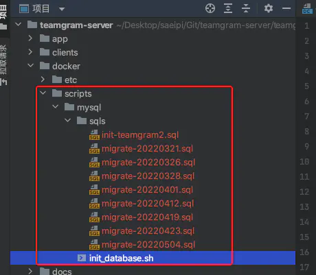
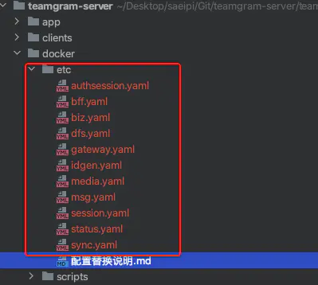

# papercraft服务端 Docker部署
> 原文: https://www.jianshu.com/p/808664f47b53
>
> 作者 @saeipi

## 1、构建镜像 Dockerfile
```
FROM golang:1.18 as build

MAINTAINER saeipi "saeipi@163.com"

ENV GO111MODULE=on \
GOPROXY=https://goproxy.cn,direct \
CGO_ENABLED=0 \
GOOS=linux \
GOARCH=amd64

RUN mkdir -p /papercraft
WORKDIR /papercraft
COPY . .
RUN chmod -R 777 *.sh
RUN /bin/sh -c ./build.sh


FROM centos:7.9.2009

RUN yum -y install vim && yum -y install net-tools

RUN mkdir -p /papercraft
COPY --from=build /papercraft/papercraftd /papercraft/papercraftd

WORKDIR /papercraft/papercraftd/etc
RUN rm -rf *

WORKDIR /papercraft/papercraftd/bin
RUN chmod -R 777 *.sh
ENTRYPOINT ["./runall2.sh"]

# 注意：需要在 runall2.sh脚本最后 添加 tail -f /dev/null
```

## 2、docker-compose.yaml
```
version: "3"

services:
mysql:
image: mysql:8.0.29
container_name: mysql
restart: always
ports:
- 3306:3306
networks:
- papercraft-net
volumes:
- ./docker/scripts/mysql:/docker-entrypoint-initdb.d
- /Volumes/data/papercraft/volumes/mysql/data:/var/lib/mysql
#- /Volumes/data/papercraft/volumes/mysql/conf:/etc/mysql
- /Volumes/data/papercraft/volumes/mysql/mysql-files:/var/lib/mysql-files
- /Volumes/data/papercraft/volumes/mysql/log:/var/log/mysql
privileged: true
environment:
TZ: Asia/Shanghai
MYSQL_ROOT_PASSWORD: papercraft2022
ALLOW_HOST: "%"
MYSQL_DATABASE: papercraft
command: [
'--character-set-server=utf8mb4',
'--collation-server=utf8mb4_unicode_ci',
'--default-time-zone=+8:00'
]

redis:
image: redis:6.2.7
container_name: redis
restart: always
ports:
- 6379:6379
networks:
- papercraft-net
volumes:
- /Volumes/data/papercraft/volumes/redis/data:/data
- /Volumes/data/papercraft/volumes/redis/conf:/usr/local/etc/redis
- /Volumes/data/papercraft/volumes/redis/config/redis.conf:/usr/local/redis/config/redis.conf
environment:
TZ: Asia/Shanghai
sysctls:
net.core.somaxconn: 1024
command: redis-server --appendonly yes

minio:
image: bitnami/minio
container_name: minio
restart: always
ports:
- '9000:9000'
- '9001:9001'
networks:
- papercraft-net
volumes:
- /Volumes/data/papercraft/volumes/minio/data:/data
- /Volumes/data/papercraft/volumes/minio/config:/root/.minio
environment:
MINIO_ROOT_USER: minio
MINIO_ROOT_PASSWORD: miniostorage

zookeeper:
image: wurstmeister/zookeeper
container_name: zookeeper
restart: always
ports:
- 2181:2181
networks:
- papercraft-net
environment:
TZ: Asia/Shanghai

kafka:
image: wurstmeister/kafka
container_name: kafka
restart: always
ports:
- 9092:9092
- 9093:9093
networks:
- papercraft-net
environment:
TZ: Asia/Shanghai
KAFKA_BROKER_ID: 0
KAFKA_ZOOKEEPER_CONNECT: zookeeper:2181
KAFKA_ADVERTISED_LISTENERS: INSIDE://kafka:9092,OUTSIDE://kafka:9093
KAFKA_LISTENERS: INSIDE://:9092,OUTSIDE://:9093
KAFKA_LISTENER_SECURITY_PROTOCOL_MAP: "INSIDE:PLAINTEXT,OUTSIDE:PLAINTEXT"
KAFKA_INTER_BROKER_LISTENER_NAME: INSIDE
depends_on:
- zookeeper

etcd:
image: bitnami/etcd:3.5
container_name: etcd
restart: always
ports:
- 2379:2379
- 2380:2380
networks:
- papercraft-net
environment:
- ALLOW_NONE_AUTHENTICATION=yes
- ETCD_ADVERTISE_CLIENT_URLS=http://etcd:2379

papercraft:
build:
context: ./
dockerfile: Dockerfile
image: papercraft:0.86.2
container_name: papercraft
restart: always
ports:
- 10443:10443
- 5222:5222
- 8801:8801
networks:
- papercraft-net
volumes:
- ./docker/etc:/papercraft/papercraftd/etc
- /Volumes/data/papercraft/volumes/logs:/papercraft/papercraftd/logs
depends_on:
- mysql
- redis
- minio
- kafka
- etcd

networks:
papercraft-net:
driver: bridge
ipam:
driver: default
config:
- subnet: 192.168.1.0/24
ip_range: 192.168.1.0/24
```



## 3、mysql初始化脚本 init_database.sh
```
#!/bin/bash
# 将papercraft2.sql改名为init-papercraft2.sql 确保先执行
MYSQL_USER=${MYSQL_USER:-root}
MYSQL_PASSWORD=${MYSQL_PASSWORD:-papercraft2022}
MYSQL_DB="papercraft"
SCRIPT_PATH=$(cd $(dirname $0);pwd)
SQL_FILE="/sqls"

folder=$SCRIPT_PATH$SQL_FILE
for file in ${folder}/*
do
mysql -u"$MYSQL_USER" -p"$MYSQL_PASSWORD" -D${MYSQL_DB} < ${file}
done

CHANGE_AUTHENTICATION="update mysql.user set authentication_string='' where user='root';"
CHANGE_PASSWORD="ALTER user 'root'@'localhost' IDENTIFIED BY '';"
FLUSH_PRIVILEGES_SQL="FLUSH PRIVILEGES;"
mysql -u"$MYSQL_USER" -p"$MYSQL_PASSWORD" -e "$CHANGE_AUTHENTICATION $CHANGE_PASSWORD $FLUSH_PRIVILEGES_SQL"
```

## 4、将mysql/redis/etcd/kafka/minos等改为通过网络名访问


```
127.0.0.1:3306
=>mysql:3306

127.0.0.1:2379
=>etcd:2379

127.0.0.1:6379
localhost:6379
=>redis:6379

127.0.0.1:9092
=>kafka:9092

127.0.0.1:9000
localhost:9000
=>minio:9000
```

### 例如 authsession.yaml

```
Name: service.authsession
ListenOn: 127.0.0.1:20450
Etcd:
Hosts:
- etcd:2379
Key: service.authsession
Log:
Mode: file
Path: ../logs/authsession
Mysql:
Addr: mysql:3306
DSN: root:@tcp(mysql:3306)/papercraft?charset=utf8mb4&parseTime=true&loc=Asia%2FShanghai
Active: 64
Idle: 64
IdleTimeout: 4h
QueryTimeout: 5s
ExecTimeout: 5s
TranTimeout: 5s
Cache:
- Host: redis:6379
  KV:
- Host: redis:6379
```

## 5、papercraft在主机部署
```
# 将papercraft容器注释
#  papercraft:
#    build:
#      context: ./
#      dockerfile: Dockerfile
#    image: papercraft:0.86.2
#    container_name: papercraft
#    restart: always
#    ports:
#      - 10443:10443
#      - 5222:5222
#      - 8801:8801
#    networks:
#      - papercraft-net
#    volumes:
#      - ./docker/etc:/papercraft/papercraftd/etc
#      - /Volumes/data/papercraft/volumes/logs:/papercraft/papercraftd/logs
#    depends_on:
#      - mysql
#      - redis
#      - minio
#      - kafka
#      - etcd
```